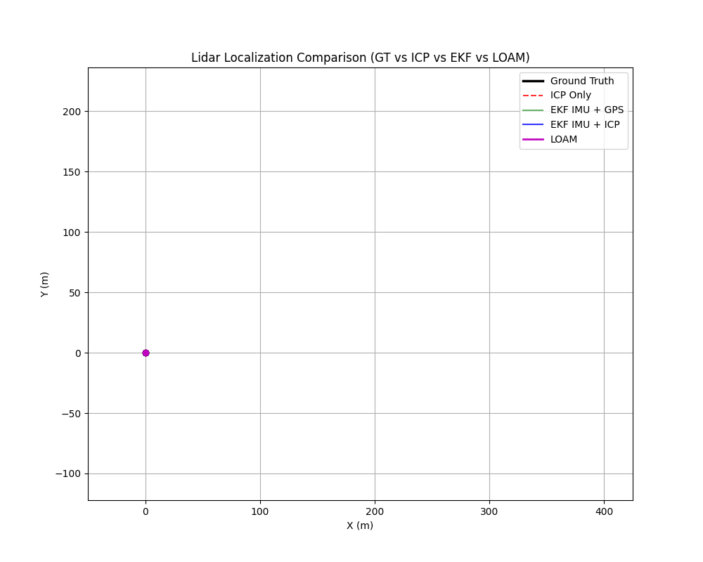

# LIDAR Localization

## Description
This project implements a LIDAR based localization using the KITTI datasets. 

The algorithm includes:

1. ICP point-to-plane pose estimation. [IMPLEMENTED]
2. Extended Kalman filter (EKF) to fuse LiDAR, GPS, and IMU pose estimation. [IMPLEMENTED]
3. Optuna-based automated hyperparameter optimization. [IMPLEMENTED]

## Algorithm Deep-Dives

| Algorithm | Readme |
|-----------|--------|
| **ICP** — Point-to-plane iterative closest point, data association, SVD pose estimation | [readme/icp.md](readme/icp.md) |
| **EKF** — Predict/update cycle, covariance, innovation, Jacobians, sensor fusion, parameter tuning | [readme/ekf.md](readme/ekf.md) |

## Usage

1. Clone the repository and navigate to the project directory.
2. Install the required dependencies (PCL, OpenCV, nlohmann/json). 
   ```bash
   ./setup.sh
   ``` 
3. Set the data path in `config/config.json`. You can also set `LOCALIZATION_METHOD` to `"ICP"`, `"EKF_GPS"`, or `"EKF_IMU"`.
4. Build the C++ executable.
    ```bash
    mkdir build
    cd build
    cmake ..
    make -j8
    ```
5. Run the executable to estimate poses (and convert KITTI data to PCD format).
   ```bash
   cd bin
   ./lidar_localization 
   ```
6. Run the Optuna tuner to automatically optimize the pipeline (Optional).
    ```bash
    ./run_optuna.sh
    ```
7. Run the Python evaluation script to compare all configurations.
    ```bash
    source venv/bin/activate
    python python/evaluation.py
    ```

## Results

Frames Evaluated: 1000

| Configuration | Translation Error (%) | Rotation Error (deg/100m) |
| :--- | :--- | :--- |
| **ICP Only** | 6.998 | 15.722 |
| **EKF ICP + GPS** | 7.888 | 16.046 |
| **EKF ICP + IMU** | 6.961 | 58.280 |

## Demo



### Observation: KPIs vs. Global Trajectory
You might notice an interesting phenomenon: **ICP Only** has the best KPI scores (Relative Pose Error), but visually drifts the most in the video. Why?

* **Relative Pose Error (RPE):** Our KPIs measure *frame-to-frame* accuracy. ICP is incredibly smooth and precise locally, achieving the best RPE. However, lacking a global anchor, its tiny 0.1% local errors accumulate over thousands of frames, resulting in massive global drift by the end of the trajectory.
* **Absolute Trajectory Error (ATE):** The **EKF ICP + GPS** configuration uses the GPS as a global anchor. Even though we injected a severe ±3m of synthetic noise into the GPS, the EKF prevents global drift, allowing it to perfectly track the true shape of the map. However, balancing the smooth ICP with the noisy GPS causes microscopic frame-to-frame jitter, which slightly degrades its RPE KPI despite being globally superior.

## Future Work
1. Run an Optuna parameter sweep specifically to tune the `EKF_IMU_NOISE` parameter to eliminate the rotational drift seen in the IMU configuration.
2. Evaluate the pipeline on the full KITTI Odometry Benchmark dataset.
