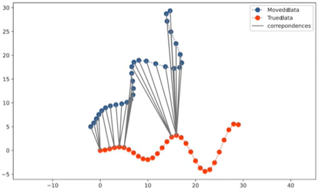

# ICP 

## Vanilla ICP

There are 2 point clouds with different poses. 

2 main steps in icp:

1. Data asscociation - Finds the nearest neighbor for each of the source point clouds in the target point clouds. The center of the point cloud is aligned.

2. Pose estimation using SVD - Multiple iterations are performed to find the best pose. The error is calculated as the distance between the source point cloud and the target point cloud. The pose is updated using SVD to minimize the error.

## Point-to-plane ICP

The error is different from point to point ICP. 

Error = $\mathbf{n}_i^\top (\mathbf{R}\mathbf{p}_i + \mathbf{t} - \mathbf{q}_i)$

Where 
n_i is the normal vector of the target point cloud
R is the rotation matrix
t is the translation vector
p_i is the source point cloud
q_i is the target point cloud

Calculating the normal of the plane in which q_i lies:

For the given point q, find the nk neighbors to form a plane Q. Take the eigenvector of the smallest eighenvalue of the covariance of Q to get the normal vector n.

2 main steps in point to plane icp:

1. Data association - Same as point to point ICP
2. Pose estimation using least square and linearization - The rotation matrix (which is a non-linear function) is linearized using Taylor expansion, and iteratevly update the pose using least square to minimize the error.

